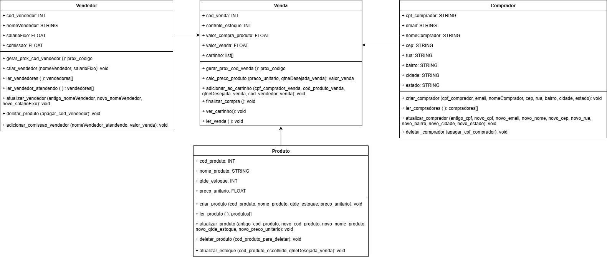
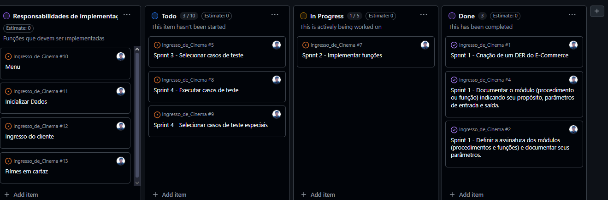
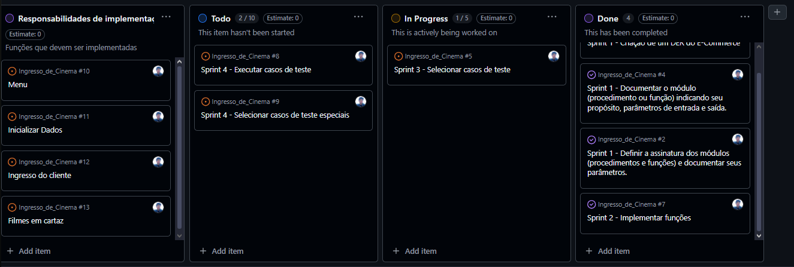
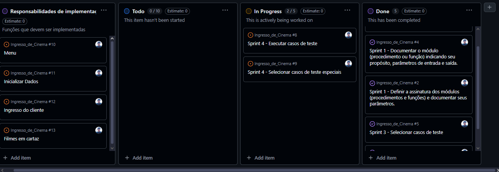
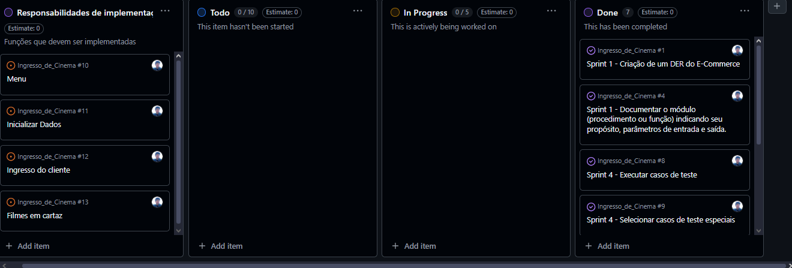

# Documentação do Projeto

## Diagrama de Classe
Diagrama do sistema, apresentando atributos e seus tipos, métodos com seus parametros e retornos.

## Apresentação
Este é um projeto feito por Vinícius Simões como entregavel para uma atividade da disciplina Fundamentos de Software do 1° período do curso.
O projeto, feito na linguagem Python, é um E-commerce de venda e compra de produtos, contando com função de contas (vendedor e cliente), permitindo que o vendedor gerencie produtos em estoque e que clientes possam vizualizar os produtos disponiveis para compra e visualizar sua nota fiscal após finalizar a compra.

## Backlog do produto
- Dia (27/06) - Backlog Sprint 1, Organização do backlog.

- Dia (28/06) - Sprint 1 finalizada, DER criado e já no GitHub. O DER possui os métodos e atributos já definidos para implementação do programa.
- Início da Sprint 2, implementação do código em python. Será apenas um arquivo que conterá todas funções e aplicações com métodos documentados.

- Dia (29/06) - Backlog Sprint 2, concluida. Ajustes ainda serão necessários no código.
- Na Sprint 3, desenho de casos de testes, documentados em arquivo "testes.txt" e aqui neste README.md. Foram levantados ao menos dois cenários para opção do no menu do sistema.

- Dia (30/06) - Backlog Sprint 3, concluida.
- Na Sprint 4, os casos de testes foram executados e os ajustes no código foram implementados.
- Adição de novos casos de testes especiais ao arquivo de testes.

- Dia (01/07) - Projeto concluido. Corrigida documentação do projeto.

## Lista de assinatura das funções e parâmetros

1. def printMenu (tipoMenu)
   - função retorna print dependendo do inteiro recebido, sendo os menus de cada operação (inicio, vendas, produtos, vendedores e compradores).
   
2. def gerar_prox_cod_venda ()
   - Função retorna qual será o próximo código de vendas.
   
3. def calc_preco_produto (preco_unitario, qtneDesejada_venda)
   - Função retorna calculo do total que será cobrado pela quantidade desejado de um determinado produto.

4. def adicionar_ao_carrinho (cpf_comprador_venda, cod_produto_venda, qtneDesejada_venda, cod_vendedor_venda)
   - Função monta uma lista de produtos em "carrinho". Testa cada parâmetro para saber se existe no sistema, caso não existe, não insere à lista.

6. def finalizar_compra ()
   - Função escreve todos produtos armazenados na lista "carrinho" para um arquivo "notaFiscal.txt" que armazena todas compras realizadas. Essa função também chama métodos para atualizar o estoque do produto comprado e atribuir comissão ao vendedor que fechou a compra.

7. def ver_carrinho():
   - Função mostra todos produtos presentes no carrinho.

8. def ler_venda ( ):
   - Função mostra toda a nota fiscal, presentes no arquivo "notaFiscal.txt"

9. def criar_produto (cod_produto, nome_produto, qtde_estoque, preco_unitario):
   - Função escreve produto em arquivo "produto.txt".

10. def ler_produto ():
   - Função mostra todos os produtos escritos no arquivo "produto.txt"

11. def atualizar_produto (antigo_cod_produto, novo_cod_produto, novo_nome_produto, novo_qtde_estoque, novo_preco_unitario):
   - Função busca produto por seu código e atualiza todas suas entredas, sobreescrevendo sua linha original no arquivo "produtos.txt".

12. def deletar_produto (cod_produto_para_deletar):
   - Função busca produto por seu código e apaga sua linha quando encontrado.

13. def atualizar_estoque (cod_produto_escolhido, qtneDesejada_venda):
   - Função para atualizar o estoque quando a compra do produto é confirmada. Busca o produto pelo código no arquivo e reescreve com seu novo valor de estoque.

14. def gerar_prox_cod_vendedor ():
   - Função identifica o próximo código de vendedor e retorna.

15. def criar_vendedor (nomeVendedor, salarioFixo):
   - Função escreve nova linha em arquivo "vendedor.txt", escrevendo seus parâmetros de entrada, sua comissão inicial em zero e o seu salário total (soma do salario fixo mais as commissões).

16. def ler_vendedor ():
   - Função mostra todos os vendedores escritos no "vendedores.txt"

17. def ler_vendedor_atendendo ():
   - Função específica para chamada no momento de venda para mostrar apenas o nome e código do vendedor.

18. def atualizar_vendedor (antigo_nomeVendedor, novo_nomeVendedor, novo_salarioFixo):
   - Função busca vendedor por seu nome e reescreve com novas entradas caso seja encontrado no arquivo "vendedor.txt"

19. def deletar_vendedor (apagar_cod_vendedor):
   - Função busca vendedor por seu código e apaga seu linha de dados no arquivo "vendedor.txt" caso encontre.

20. def adicionar_comissao_vendedor (nomeVendedor_atendendo, valor_venda):
   - Função busca vendedor por seu nome e atualiza o valor da sua comissão, calculando 3% do valor total da compra

21. def criar_comprador (cpf_comprador, email, nomeComprador, cep, rua, bairro, cidade, estado):
   - Função para escrever novo comprador no arquivo "comprador.txt".

23. def ler_comprador ():
   - Função mostra todos os compradores registrados no arquivo "comprador.txt".

24. def atualizar_comprador (antigo_cpf_comprador, novo_cpf_comprador, novo_email, novo_nomeComprador, novo_cep, novo_rua, novo_bairro, novo_cidade, novo_estado):
   - Função que busca comprador por seu CPF e caso encontre, reescreve seus dados no arquivo "comprador.txt".

25. def deletar_comprador (apagar_cpf_comprador):
   - Função que busca comprador por seu CPF e caso encontre apaga sua linha.

27. def main():
   - Função que executa o sistema, chamando os métodos conforme entrado do usuário.

## Testes
### Casos de Testes do Software:
Os casos de teste englobam todo o código, uma vez que as funções devem receber parâmetros
que podem estar dentro de outras funções ou do código principal.

#### Caso de teste 1: Gerar próximo cód de venda

|        **Entradas**         |        **Classes Válidas**        |        **Resultado Esperado**                |        **Classes Inválidas**                     |        **Resultado**        |
| :---:                       | :---:                             | :---:                                        | :---:                                            | :---:                       |
| Arquivo notaFiscal.txt vazio| Início da contagem                | "1". Caso arquivo não encontrado, sinalizar. | Arquivo notaFiscal.txt com linhas mal formatadas | "1"                         |
| Arquivo notaFiscal.txt com 3 linhas| Continuição da contagem    | "4"                                          | Arquivo notaFiscal.txt com linhas mal formatadas | "4"                         |

#### Caso de teste 2: Calcular preço total do produto

|        **Entradas**         |        **Classes Válidas**        |        **Resultado Esperado**                |        **Classes Inválidas**                     |        **Resultado**        |
| :---:                       | :---:                             | :---:                                        | :---:                                            | :---:                       |
| Valor unitário do produto = 2.00 e quantidade comprada = 2. | Produto existente, estoque disponivel |  4.00    | Produto não existe ou sem estoque.               | 4.00                        |
| Valor unitário do produto = 2.00 e quantidade comprada = -2.| Produto existente, estoque disponivel |  Erro, valor não poder ser negativo. | Produto não existe ou sem estoque. | Erro...       |

#### Caso de teste 3: Adicionar ao carrinho

|        **Entradas**         |        **Classes Válidas**        |        **Resultado Esperado**                |        **Classes Inválidas**                     |        **Resultado**        |
| :---:                       | :---:                             | :---:                                        | :---:                                            | :---:                       |
| CPF, CodProduto, Qtde, CodVendedor | Arquivos produto.txt, vendedor.txt, comprador.txt possuem os registro | Produto adicionado ao carrinho | Ao menos um dos arquivos não possui a entrada| Produto adicionado... |
| CPF, CodProduto, Qtde, -CodVendedor | Arquivos produto.txt, vendedor.txt, comprador.txt possuem os registro | Vendedor não encontrado, cancela pedido | Ao menos um dos arquivos não possui a entrada| Pedido cancelado... |

#### Caso de teste 4: Finalizar compra

|        **Entradas**         |        **Classes Válidas**        |        **Resultado Esperado**                |        **Classes Inválidas**                     |        **Resultado**        |
| :---:                       | :---:                             | :---:                                        | :---:                                            | :---:                       |
| Carrinho vazio              | Carrinho existes                  | O carrinho está vazio. Adicione produtos!    | Não criou lista carrinho                         | O carrinho está vazio...    |
| Carrinho com itens          | Carrinho existes        | Produtos XX comprados com sucesso. Nota fiscal gerada  | Não criou lista carrinho             | Produtos comprados e nota fiscal gerada    |

#### Caso de teste 5: Ver carrinho

|        **Entradas**         |        **Classes Válidas**        |        **Resultado Esperado**                |        **Classes Inválidas**                     |        **Resultado**        |
| :---:                       | :---:                             | :---:                                        | :---:                                            | :---:                       |
| Lista do carrinho está vazia. | Carrinho exite                  | O carrinho está vazio. Adicione produtos!    | Não criou lista carrinho                         | O carrinho está vazio...    |
| Lista do carrinho cheio     | Carrinho exite                    | Exibir lista de produtos registrado          | Não criou lista carrinho                         | Lista de dos produtos no carrinho.|

#### Caso de teste 6: Ler Notas Fiscais

|        **Entradas**         |        **Classes Válidas**        |        **Resultado Esperado**                |        **Classes Inválidas**                     |        **Resultado**        |
| :---:                       | :---:                             | :---:                                        | :---:                                            | :---:                       |
| Arquivo vazio.              | Arquivo exites.                   | Nenhuma compra feita ainda.                  | Não criou arquivo "notaFisal"                    | Nenhuma compra feita ainda. |
| Arquivo preenchido.         | Arquivo exites.                   | Imprimir registros do arquivo.               | Não criou arquivo "notaFisal"                | Lista de todos registros do arquivo. |

#### Caso de teste 7: Criar produto

|        **Entradas**         |        **Classes Válidas**        |        **Resultado Esperado**                |        **Classes Inválidas**             |        **Resultado**        |
| :---:                       | :---:                             | :---:                                        | :---:                                    | :---:                       |
| Entrada com parâmetros incorretos | Arquivo "produto.txt" existe. | Entradas invorretas. Cadastro cancelado.   | Arquivo "produto.txt" não existe.        | Cadastro não efetuado       |
| Entrada com parâmetros corretos | Arquivo "produto.txt" existe. | Cadastro realizado com sucesso.              | Arquivo "produto.txt" não existe.        | Cadastro efetuado com sucesso |

#### Caso de teste 8: Ler Produtos

|        **Entradas**         |        **Classes Válidas**        |        **Resultado Esperado**                |        **Classes Inválidas**                     |        **Resultado**        |
| :---:                       | :---:                             | :---:                                        | :---:                                            | :---:                       |
| Arquivo vazio.              | Arquivo exites.                   | Nenhuma compra feita ainda.                  | Não criou arquivo "produtos.txt"                 | Nenhuma produto registrado. |
| Arquivo preenchido.         | Arquivo exites.                   | Imprimir registros do arquivo.               | Não criou arquivo "produtos.txt"          | Imprimir produtos registros no arquivo. |

#### Caso de teste 9: Atualizar produto

|        **Entradas**         |        **Classes Válidas**        |        **Resultado Esperado**                |        **Classes Inválidas**                     |        **Resultado**        |
| :---:                       | :---:                             | :---:                                        | :---:                                            | :---:                       |
| Cód. antigo e novos dados   | Arquivo "produtos.txt" existe     | Reescrita dos dados corretamente             | Arquivo "produtos.txt" não existe   | Atualização correta dos dados no arquivo |
| Cód. antigo e dados repetidos | Arquivo "produtos.txt" existe   | Reescreve os dados da mesma forma            | Arquivo "produtos.txt" não existe      | Reescrita dos mesmos dados no arquivo |

#### Caso de teste 10: Deletar produto

|        **Entradas**         |        **Classes Válidas**        |        **Resultado Esperado**                |        **Classes Inválidas**                     |        **Resultado**        |
| :---:                       | :---:                             | :---:                                        | :---:                                            | :---:                       |
| cod_produto_para_deletar existente em produto.txt | cod_produto_para_deletar correspondente a um produto existente. | Produto removido de produto.txt e mensagem de sucesso. | cod_produto_para_deletar não encontrado | Mensagem "O produto ... foi encontrado e deletado." |
| cod_produto_para_deletar não existente em produto.txt | cod_produto_para_deletar correspondente a um produto existente. | Produto não foi encontrado no produto.txt. | cod_produto_para_deletar não encontrado | Mensagem "O produto ... não foi encontrado." |

#### Caso de teste 11: Atualizar o estoque

|        **Entradas**         |        **Classes Válidas**        |        **Resultado Esperado**                |        **Classes Inválidas**                     |        **Resultado**        |
| :---:                       | :---:                             | :---:                                        | :---:                                            | :---:                       |
| cod_produto_escolhido existe, qtneDesejada_venda <= estoque. | Produto encontrado e quantidade em estoque suficiente. | Estoque do produto atualizado em produto.txt, retorna True. | cod_produto_escolhido não encontrado | Mensagem "Produto de código ... foi encontrado no estoque.", retorna False |
| cod_produto_escolhido existe, qtneDesejada_venda > estoque. | Produto encontrado e quantidade em estoque suficiente. | Estoque do produto atualizado em produto.txt, retorna True. | Produto encontrado, mas quantidade em estoque insuficiente. | Quantidade de produto ... em estoque ... insuficiente...", retorna False. |

#### Caso de teste 12: Gerar próximo cód de vendedor

|        **Entradas**         |        **Classes Válidas**        |        **Resultado Esperado**                |        **Classes Inválidas**                     |        **Resultado**        |
| :---:                       | :---:                             | :---:                                        | :---:                                            | :---:                       |
| Arquivo vendedor.txt vazio| Início da contagem                | "1". Caso arquivo não encontrado, sinalizar. | Arquivo vendedor.txt com linhas mal formatadas | "1"                         |
| Arquivo vendedor.txt com 3 linhas| Continuição da contagem    | "4"                                          | Arquivo vendedor.txt com linhas mal formatadas | "4"                         |

#### Caso de teste 13: Criar vendedor

|        **Entradas**         |        **Classes Válidas**        |        **Resultado Esperado**                |        **Classes Inválidas**             |        **Resultado**        |
| :---:                       | :---:                             | :---:                                        | :---:                                    | :---:                       |
| nomeVendedor único, salarioFixo numérico. | Dados de vendedor válidos e nomeVendedor não existente | Vendedor adicionado a vendedor.txt com novo código e mensagem de sucesso.   | nomeVendedor já existe | Vendedor adicionado a vendedor.txt com novo código e mensagem de sucesso.       |
| nomeVendedor repetido, salarioFixo numérico. | Dados de vendedor válidos e nomeVendedor não existente | Vendedor já existente, mensagem de erro.   | nomeVendedor já existe  | Vendedor já existe, mensagem de erro. |

#### Caso de teste 14: Ler Vendedores

|        **Entradas**         |        **Classes Válidas**        |        **Resultado Esperado**                |        **Classes Inválidas**                     |        **Resultado**        |
| :---:                       | :---:                             | :---:                                        | :---:                                            | :---:                       |
| Arquivo vazio.              | Arquivo exites.                   | Nenhuma compra feita ainda.                  | Não criou arquivo "vendedor.txt"                 | Nenhuma produto registrado. |
| Arquivo preenchido.         | Arquivo exites.                   | Imprimir registros do arquivo.               | Não criou arquivo "vendedor.txt"          | Imprimir produtos registros no arquivo. |

#### Caso de teste 15: Ler Vendedores Atendendo

|        **Entradas**         |        **Classes Válidas**        |        **Resultado Esperado**                |        **Classes Inválidas**                     |        **Resultado**        |
| :---:                       | :---:                             | :---:                                        | :---:                                            | :---:                       |
| Arquivo vazio.              | Arquivo exites.                   | Nenhuma compra feita ainda.                  | Não criou arquivo "vendedor.txt"                 | Nenhuma produto registrado. |
| Arquivo preenchido.         | Arquivo exites.                   | Imprimir registros do arquivo.               | Não criou arquivo "vendedor.txt"          | Imprimir produtos registros no arquivo. |

#### Caso de teste 16: Atualizar vendedor

|        **Entradas**         |        **Classes Válidas**        |        **Resultado Esperado**                |        **Classes Inválidas**                     |        **Resultado**        |
| :---:                       | :---:                             | :---:                                        | :---:                                            | :---:                       |
| Cód. antigo e novos dados   | Arquivo "vendedor.txt" existe     | Reescrita dos dados corretamente             | Arquivo "vendedor.txt" não existe   | Atualização correta dos dados no arquivo |
| Cód. antigo e dados repetidos | Arquivo "vendedor.txt" existe   | Reescreve os dados da mesma forma            | Arquivo "vendedor.txt" não existe      | Reescrita dos mesmos dados no arquivo |

#### Caso de teste 17: Deletar vendedor

|        **Entradas**         |        **Classes Válidas**        |        **Resultado Esperado**                |        **Classes Inválidas**                     |        **Resultado**        |
| :---:                       | :---:                             | :---:                                        | :---:                                            | :---:                       |
| cod_vendedor_para_deletar existente em vendedor.txt | cod_vendedor_para_deletar correspondente a um vendedor existente. | Vendedor removido de vendedor.txt e mensagem de sucesso. | cod_vendedor_para_deletar não encontrado | Mensagem "O vendedor ... foi encontrado e deletado." |
| cod_vendedor_para_deletar não existente em vendedor.txt | cod_vendedor_para_deletar correspondente a um vendedor existente. | Vendedor não foi encontrado no vendedor.txt. | cod_vendedor_para_deletar não encontrado | Mensagem "O vendedor ... não foi encontrado." |

#### Caso de teste 18: Adicionar comissao vendedor

|        **Entradas**         |        **Classes Válidas**        |        **Resultado Esperado**                |        **Classes Inválidas**                     |        **Resultado**        |
| :---:                       | :---:                             | :---:                                        | :---:                                            | :---:                       |
| nomeVendedor_atendendo existe, valor_venda numérico. | Vendedor encontrado e valor_venda válido. | Comissão e salário do mês do vendedor atualizados em vendedor.txt. | nomeVendedor_atendendo não encontrado | Comissão e salário do mês do vendedor atualizados em vendedor.txt. |
| nomeVendedor_atendendo não existe, valor_venda numérico. | Vendedor encontrado e valor_venda válido. | Vendedores não encontrado no vendedor.txt. | nomeVendedor_atendendo não encontrado | Vendedores não encontrado no vendedor.txt |

#### Caso de teste 19: Criar comprador

|        **Entradas**         |        **Classes Válidas**        |        **Resultado Esperado**                |        **Classes Inválidas**             |        **Resultado**        |
| :---:                       | :---:                             | :---:                                        | :---:                                    | :---:                       |
| cpf_comprador único, demais dados válidos. | Dados de comprador válidos e cpf_comprador não existente. | Comprador adicionado a comprador.txt e mensagem de sucesso. | cpf_comprador já existe em comprador.txt | Comprador adicionado a comprador.txt e mensagem de sucesso. |
| cpf_comprador repetido, demais dados válidos. | Dados de comprador válidos e cpf_comprador não existente. | Comprador já registrado no comprador.txt, mensagem de erro "comprador já registrado". | cpf_comprador já existe em comprador.txt | Comprador já registrado no comprador.txt, mensagem de erro "comprador já registrado". |

#### Caso de teste 20: Ler comprador

|        **Entradas**         |        **Classes Válidas**        |        **Resultado Esperado**                |        **Classes Inválidas**                     |        **Resultado**        |
| :---:                       | :---:                             | :---:                                        | :---:                                            | :---:                       |
| Arquivo vazio.              | Arquivo exites.                   | Nenhum comprador registrado ainda.           | Não criou arquivo "comprador.txt"                | Nenhuma comprador registrado. |
| Arquivo preenchido.         | Arquivo exites.                   | Imprimir registros do arquivo.               | Não criou arquivo "comprador.txt"          | Imprimir produtos registros no arquivo. |

#### Caso de teste 21: Atualizar comprador

|        **Entradas**         |        **Classes Válidas**        |        **Resultado Esperado**                |        **Classes Inválidas**                     |        **Resultado**        |
| :---:                       | :---:                             | :---:                                        | :---:                                            | :---:                       |
| antigo_cpf_comprador existente, novos dados válidos. | antigo_cpf_comprador correspondente a um comprador existente, novos dados válidos. | Comprador atualizado em comprador.txt e mensagem de sucesso. | antigo_cpf_comprador não encontrado | Comprador atualizado em comprador.txt e mensagem de sucesso. |
| antigo_cpf_comprador repetido, novos dados válidos. | antigo_cpf_comprador correspondente a um comprador existente, novos dados válidos. | Comprador já registrado comprador.txt, reescreve mesmos dados e mensagem de sucesso. | antigo_cpf_comprador não encontrado | Comprador atualizado em comprador.txt e mensagem de sucesso. |

#### Caso de teste 22: Deletar comprador

|        **Entradas**         |        **Classes Válidas**        |        **Resultado Esperado**                |        **Classes Inválidas**                     |        **Resultado**        |
| :---:                       | :---:                             | :---:                                        | :---:                                            | :---:                       |
| apagar_cpf_comprador existente em comprador.txt. | apagar_cpf_comprador correspondente a um comprador existente. | Comprador removido de comprador.txt e mensagem de sucesso. | apagar_cpf_comprador não encontrado | Comprador removido de comprador.txt e mensagem de sucesso. |
| apagar_cpf_comprador não existente em comprador.txt. | apagar_cpf_comprador correspondente a um comprador existente. | Comprador não encontrado no arquivo comprador.txt, mensagem de alerta. | apagar_cpf_comprador não encontrado | Comprador não encontrado no arquivo comprador.txt, mensagem de alerta. |

#### Caso de teste 23: Fluxo do sistema

|        **Entradas**         |        **Classes Válidas**        |        **Resultado Esperado**                |        **Classes Inválidas**                     |        **Resultado**        |
| :---:                       | :---:                             | :---:                                        | :---:                                            | :---:                       |
| acessar menu de gerenciamento de vendedores. | Todos menus se interligam corretamente | Acesso menu de gerenciamento de compradores. | Menu interrompe o processo | Menu de gerenciamento de compradores acessado com mensagem de sucesso. |
| acessar menu de gerenciamento de produtps. | Todos menus se interligam corretamente | Acesso menu de gerenciamento de produtos. | Menu interrompe o processo | Menu de gerenciamento de produtos acessado com mensagem de sucesso. |

#### Rélatorio de Execução de Teste

|  **Teste 1 - Gerar próximo cód de venda**   |
|        **Entradas**         |        **Classes Válidas**        |        **Resultado Esperado**                |        **Classes Inválidas**                     |        **Resultado**        |
| :---:                       | :---:                             | :---:                                        | :---:                                            | :---:                       |
| Arquivo notaFiscal.txt vazio| Início da contagem                | "1". Caso arquivo não encontrado, sinalizar. | Arquivo notaFiscal.txt com linhas mal formatadas | "1"                         |

|    **Entradas**       |      **Resultado**      |        **Aprovado?**        |
|       :---:           |        :---:            |            :---:            |
|     Arquivo vazio     |            1            |             sim             |
|  Arquivo com 1 linhas |            2            |             sim             |
|  Arquivo com 2 linhas |            3            |             sim             |
|  Arquivo com 3 linhas |            4            |             sim             |

|  **Teste 2 - Calcular preço total do produto**   |
|        **Entradas**         |        **Classes Válidas**        |        **Resultado Esperado**                |        **Classes Inválidas**                     |        **Resultado**        |
| :---:                       | :---:                             | :---:                                        | :---:                                            | :---:                       |
| Valor unitário do produto = 2.00 e quantidade comprada = 2. | Produto existente, estoque disponivel |  4.00    | Produto não existe ou sem estoque.               | 4.00                        |

|     **Entradas**        |      **Resultado**      |        **Aprovado?**        |
|        :---:            |        :---:            |            :---:            |
| valor = 5.00, qtde = 1  |          5.00           |             sim             |
| valor = 10.00, qtde = 2 |          20.00          |             sim             |
| valor = 5.00, qtde = -1 |  Erro, valor negativo   |             sim             |
| valor = -5.00, qtde = 1 |  Erro, valor negativo   |             sim             |
| valor = 5.00, qtde = 0  |  Erro, valor negativo   |             sim             |

|  **Teste 3 - Adicionar ao carrinho**   |
|        **Entradas**         |        **Classes Válidas**        |        **Resultado Esperado**                |        **Classes Inválidas**                     |        **Resultado**        |
| :---:                       | :---:                             | :---:                                        | :---:                                            | :---:                       |
| 10010010010, 001, 3, 4 | Arquivos produto.txt, vendedor.txt, comprador.txt possuem os registro | Produto adicionado ao carrinho | Ao menos um dos arquivos não possui a entrada| Produto adicionado... |

|     **Entradas**        |      **Resultado**           |        **Aprovado?**        |
|        :---:            |        :---:                 |            :---:            |
| 10010010010, 001, 3, 4  | Adicionado ao carrinho       |             sim             |
| 20020020020, 001, -4, 1 | Erro, quantidade negativa    |             sim             |
| 10010010010, 007, 1, -2 | Erro, vendedor não existe    |             sim             |
| 10010010010, -001, 3, 9 | Erro, produto não encontrado |             sim             |

|  **Teste 4 - Fechar ao carrinho**   |
|        **Entradas**         |        **Classes Válidas**        |        **Resultado Esperado**                |        **Classes Inválidas**                     |        **Resultado**        |
| :---:                       | :---:                             | :---:                                        | :---:                                            | :---:                       |
| Carrinho vazio              | Carrinho existes                  | O carrinho está vazio. Adicione produtos!    | Não criou lista carrinho                         | O carrinho está vazio...    |

|     **Entradas**        |      **Resultado**                 |        **Aprovado?**        |
|        :---:            |        :---:                       |            :---:            |
| Carrinho vazio          | Carrinho vazio, adicione produtos! |             sim             |
| Carrinho com 1 produto  | Produto X comprado, valor Y        |             sim             |
| Carrinho com 2 produto  | Produto X comprado, valor Y; Produto Z comprado, valor W | sim   |

|  **Teste 5 - Ver carrinho**   |
|        **Entradas**           |        **Classes Válidas**        |        **Resultado Esperado**                |        **Classes Inválidas**                     |        **Resultado**        |
| :---:                         | :---:                             | :---:                                        | :---:                                            | :---:                       |
| Lista do carrinho está vazia. | Carrinho exite                    | O carrinho está vazio. Adicione produtos!    | Não criou lista carrinho                         | O carrinho está vazio...    |

|     **Entradas**             |      **Resultado**                 |        **Aprovado?**        |
|        :---:                 |        :---:                       |            :---:            |
| Carrinho vazio          | Carrinho vazio, adicione produtos! |             sim             |
| Carrinho com 1 produto  | Produto X comprado, valor Y        |             sim             |
| Carrinho com 2 produto  | Produto X comprado, valor Y; Produto Z comprado, valor W | sim   |

|  **Teste 6 - Ler Notas Fiscais**   |
|        **Entradas**         |        **Classes Válidas**        |        **Resultado Esperado**                |        **Classes Inválidas**                     |        **Resultado**        |
| :---:                       | :---:                             | :---:                                        | :---:                                            | :---:                       |
| Arquivo vazio.              | Arquivo exites.                   | Nenhuma compra feita ainda.                  | Não criou arquivo "notaFisal"                    | Nenhuma compra feita ainda. |

|     **Entradas**      |     **Resultado**                 |        **Aprovado?**        |
|        :---:          |       :---:                       |            :---:            |
|      Arquivo vazio    | Nenhuma nota fical encontrada     |             sim             |
|  Arquivo com 1 linhas | Mostrar a linha do arquivo        |             sim             |
|  Arquivo com 2 linhas | Mostrar as 2 linhas do arquivo    |             sim             |
|  Arquivo com 3 linhas | Mostrar as 3 linhas do arquivo    |             sim             |

|  **Teste 7 - Criar produto**   |
|        **Entradas**         |        **Classes Válidas**        |        **Resultado Esperado**                |        **Classes Inválidas**                     |        **Resultado**        |
| :---:                       | :---:                             | :---:                                        | :---:                                            | :---:                       |

|     **Entradas**        |      **Resultado**                 |        **Aprovado?**        |
|        :---:            |        :---:                       |            :---:            |
| Carrinho vazio          | Carrinho vazio, adicione produtos! |             sim             |

|  **Teste 8 - Ler Produtos**   |
|        **Entradas**         |        **Classes Válidas**        |        **Resultado Esperado**                |        **Classes Inválidas**                     |        **Resultado**        |
| :---:                       | :---:                             | :---:                                        | :---:                                            | :---:                       |

|     **Entradas**      |     **Resultado**                 |        **Aprovado?**        |
|        :---:          |       :---:                       |            :---:            |
|      Arquivo vazio    | Nenhum produto encontrada         |             sim             |
|  Arquivo com 1 linhas | Mostrar a linha do arquivo        |             sim             |
|  Arquivo com 2 linhas | Mostrar as 2 linhas do arquivo    |             sim             |
|  Arquivo com 3 linhas | Mostrar as 3 linhas do arquivo    |             sim             |

|  **Teste 9 - Atualizar produto**   |
|        **Entradas**         |        **Classes Válidas**        |        **Resultado Esperado**                |        **Classes Inválidas**                     |        **Resultado**        |
| :---:                       | :---:                             | :---:                                        | :---:                                            | :---:                       |

|     **Entradas**        |      **Resultado**                 |        **Aprovado?**        |
|        :---:            |        :---:                       |            :---:            |
| Carrinho vazio          | Carrinho vazio, adicione produtos! |             sim             |

|  **Teste 10 - Deletar produto**   |
|        **Entradas**         |        **Classes Válidas**        |        **Resultado Esperado**                |        **Classes Inválidas**                     |        **Resultado**        |
| :---:                       | :---:                             | :---:                                        | :---:                                            | :---:                       |

|     **Entradas**        |      **Resultado**                 |        **Aprovado?**        |
|        :---:            |        :---:                       |            :---:            |
| Carrinho vazio          | Carrinho vazio, adicione produtos! |             sim             |

|  **Teste 11 - Atualizar o estoque**   |
|        **Entradas**         |        **Classes Válidas**        |        **Resultado Esperado**                |        **Classes Inválidas**                     |        **Resultado**        |
| :---:                       | :---:                             | :---:                                        | :---:                                            | :---:                       |

|     **Entradas**        |      **Resultado**                 |        **Aprovado?**        |
|        :---:            |        :---:                       |            :---:            |
| Carrinho vazio          | Carrinho vazio, adicione produtos! |             sim             |

|  **Teste 12 - Gerar próximo cód de vendedor**   |
|        **Entradas**         |        **Classes Válidas**        |        **Resultado Esperado**                |        **Classes Inválidas**                     |        **Resultado**        |
| :---:                       | :---:                             | :---:                                        | :---:                                            | :---:                       |

|     **Entradas**        |      **Resultado**                 |        **Aprovado?**        |
|        :---:            |        :---:                       |            :---:            |
| Carrinho vazio          | Carrinho vazio, adicione produtos! |             sim             |

|  **Teste 13 - Criar vendedor**   |
|        **Entradas**         |        **Classes Válidas**        |        **Resultado Esperado**                |        **Classes Inválidas**                     |        **Resultado**        |
| :---:                       | :---:                             | :---:                                        | :---:                                            | :---:                       |

|     **Entradas**        |      **Resultado**                 |        **Aprovado?**        |
|        :---:            |        :---:                       |            :---:            |
| Carrinho vazio          | Carrinho vazio, adicione produtos! |             sim             |

|  **Teste 14 - Ler Vendedores**   |
|        **Entradas**         |        **Classes Válidas**        |        **Resultado Esperado**                |        **Classes Inválidas**                     |        **Resultado**        |
| :---:                       | :---:                             | :---:                                        | :---:                                            | :---:                       |

|     **Entradas**      |     **Resultado**                 |        **Aprovado?**        |
|        :---:          |       :---:                       |            :---:            |
|      Arquivo vazio    | Nenhum vendedor encontrado        |             sim             |
|  Arquivo com 1 linhas | Mostrar a linha do arquivo        |             sim             |
|  Arquivo com 2 linhas | Mostrar as 2 linhas do arquivo    |             sim             |
|  Arquivo com 3 linhas | Mostrar as 3 linhas do arquivo    |             sim             |

|  **Teste 15 - Ler Vendedores Atendendo**   |
|        **Entradas**         |        **Classes Válidas**        |        **Resultado Esperado**                |        **Classes Inválidas**                     |        **Resultado**        |
| :---:                       | :---:                             | :---:                                        | :---:                                            | :---:                       |

|     **Entradas**      |     **Resultado**                 |        **Aprovado?**        |
|        :---:          |       :---:                       |            :---:            |
|      Arquivo vazio    | Nenhum vendedor encontrado        |             sim             |
|  Arquivo com 1 linhas | Mostrar a linha do arquivo        |             sim             |
|  Arquivo com 2 linhas | Mostrar as 2 linhas do arquivo    |             sim             |
|  Arquivo com 3 linhas | Mostrar as 3 linhas do arquivo    |             sim             |

|  **Teste 16 - Atualizar vendedor**   |
|        **Entradas**         |        **Classes Válidas**        |        **Resultado Esperado**                |        **Classes Inválidas**                     |        **Resultado**        |
| :---:                       | :---:                             | :---:                                        | :---:                                            | :---:                       |

|     **Entradas**        |      **Resultado**                 |        **Aprovado?**        |
|        :---:            |        :---:                       |            :---:            |
| Carrinho vazio          | Carrinho vazio, adicione produtos! |             sim             |

|  **Teste 17 - Deletar vendedor**   |
|        **Entradas**         |        **Classes Válidas**        |        **Resultado Esperado**                |        **Classes Inválidas**                     |        **Resultado**        |
| :---:                       | :---:                             | :---:                                        | :---:                                            | :---:                       |

|     **Entradas**        |      **Resultado**                 |        **Aprovado?**        |
|        :---:            |        :---:                       |            :---:            |
| Carrinho vazio          | Carrinho vazio, adicione produtos! |             sim             |

|  **Teste 18 - Adicionar comissao vendedor**   |
|        **Entradas**         |        **Classes Válidas**        |        **Resultado Esperado**                |        **Classes Inválidas**                     |        **Resultado**        |
| :---:                       | :---:                             | :---:                                        | :---:                                            | :---:                       |

|     **Entradas**        |      **Resultado**                 |        **Aprovado?**        |
|        :---:            |        :---:                       |            :---:            |
| Carrinho vazio          | Carrinho vazio, adicione produtos! |             sim             |

|  **Teste 19 - Criar comprador**   |
|        **Entradas**         |        **Classes Válidas**        |        **Resultado Esperado**                |        **Classes Inválidas**                     |        **Resultado**        |
| :---:                       | :---:                             | :---:                                        | :---:                                            | :---:                       |

|     **Entradas**        |      **Resultado**                 |        **Aprovado?**        |
|        :---:            |        :---:                       |            :---:            |
| Carrinho vazio          | Carrinho vazio, adicione produtos! |             sim             |

|  **Teste 20 - Ler comprador**   |
|        **Entradas**         |        **Classes Válidas**        |        **Resultado Esperado**                |        **Classes Inválidas**                     |        **Resultado**        |
| :---:                       | :---:                             | :---:                                        | :---:                                            | :---:                       |

|     **Entradas**      |     **Resultado**                 |        **Aprovado?**        |
|        :---:          |       :---:                       |            :---:            |
|      Arquivo vazio    | Nenhum comprador encontrado       |             sim             |
|  Arquivo com 1 linhas | Mostrar a linha do arquivo        |             sim             |
|  Arquivo com 2 linhas | Mostrar as 2 linhas do arquivo    |             sim             |
|  Arquivo com 3 linhas | Mostrar as 3 linhas do arquivo    |             sim             |

|  **Teste 21 - Atualizar comprador**   |
|        **Entradas**         |        **Classes Válidas**        |        **Resultado Esperado**                |        **Classes Inválidas**                     |        **Resultado**        |
| :---:                       | :---:                             | :---:                                        | :---:                                            | :---:                       |

|     **Entradas**        |      **Resultado**                 |        **Aprovado?**        |
|        :---:            |        :---:                       |            :---:            |
| Carrinho vazio          | Carrinho vazio, adicione produtos! |             sim             |

|  **Teste 22 - Deletar comprador**   |
|        **Entradas**         |        **Classes Válidas**        |        **Resultado Esperado**                |        **Classes Inválidas**                     |        **Resultado**        |
| :---:                       | :---:                             | :---:                                        | :---:                                            | :---:                       |

|     **Entradas**        |      **Resultado**                 |        **Aprovado?**        |
|        :---:            |        :---:                       |            :---:            |
| Carrinho vazio          | Carrinho vazio, adicione produtos! |             sim             |

|  **Teste 23 - Fluxo do sistema**   |
|        **Entradas**         |        **Classes Válidas**        |        **Resultado Esperado**                |        **Classes Inválidas**                     |        **Resultado**        |
| :---:                       | :---:                             | :---:                                        | :---:                                            | :---:                       |

|     **Entradas**        |      **Resultado**                 |        **Aprovado?**        |
|        :---:            |        :---:                       |            :---:            |
| Carrinho vazio          | Carrinho vazio, adicione produtos! |             sim             |

## Código fonte com testes automatizados
