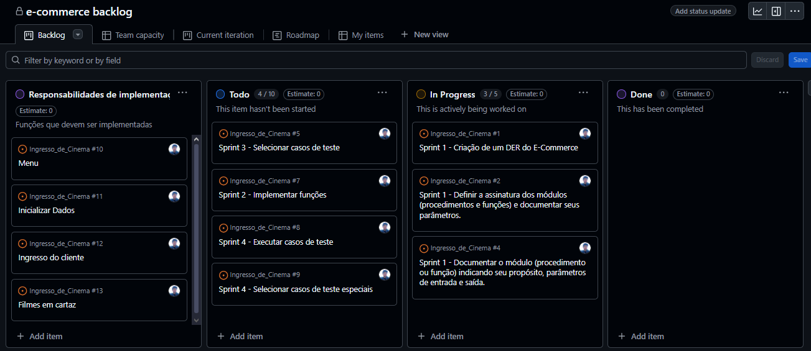

# Documentação do Projeto

## Diagrama de Classe
Diagrama do sistema, apresentando atributos e seus tipos, métodos com seus parametros e retornos.

## Apresentação
Este é um projeto feito por Vinícius Simões como entregavel para uma atividade da disciplina Fundamentos de Software do 1° período do curso.
O projeto, feito na linguagem Python, é um E-commerce de venda e compra de produtos, contando com função de contas (vendedor e cliente), permitindo que o vendedor gerencie produtos em estoque e que clientes possam vizualizar os produtos disponiveis para compra e visualizar sua nota fiscal após finalizar a compra.

## Backlog do produto
- Dia (27/06) - Backlog Sprint 1, Organização do backlog.

- Dia (28/06)

## Lista de assinatura das funções e parâmetros
1. int blablabla (int mi)
   função retorna tal tal, nos casos de X tal, case de Y tal
   
3. void blebleble ()
   Função imprime tal
   
5. def bliblibli ()

## Testes
### Casos de Testes do Software:
Os casos de teste englobam todo o código, uma vez que as funções devem receber parâmetros
que podem estar dentro de outras funções ou do código principal.

#### Caso de teste 1: Cadastro de Filme
(montar tabela[Entradas, Classes Válidas, Resultado Esperado, Classes Inválidas, Resultado])

#### Rélatorio de Execução de Teste
(montar tabela)

## Código fonte com testes automatizados
